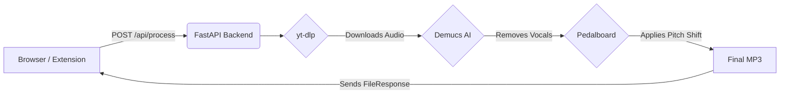

<div align="center">
  <h1>🎤 Karaoke Maker Chrome Extension 🎶</h1>
  <p>
    <b>Turn any YouTube or Instagram music video into a customizable Karaoke track instantly!</b>
  </p>
</div>

<p align="center">
  
  
  
  
  
</p>

## ✨ Discover the Magic of Instant Karaoke
Ever wanted to sing along to a song on YouTube but couldn't find an instrumental version? Or maybe you found one, but it's not in a key that fits your voice? 

**Karaoke Maker** is a powerful Chrome Extension that seamlessly integrates with your browser to extract audio from YouTube and Instagram links, isolate the instrumental track by removing vocals using AI, and adjust the pitch so you can sing exactly the way you want to!

---

## 🚀 Key Features

*   **🌐 Universal Compatibility:** Works effortlessly with YouTube and Instagram URLs.
*   **🤖 AI-Powered Vocal Separation:** Uses state-of-the-art Deep Learning (`Demucs` via PyTorch) to cleanly remove vocals from any song.
*   **🎚️ Dynamic Pitch Shifting:** Adjust the key of the backtrack up or down to perfectly match your vocal range. 
*   **⬇️ Instant Download:** Get a high-quality `.mp3` instrumental track right to your downloads folder.
*   **⚡ Native Chrome Experience:** Simple, intuitive extension popup UI that communicates with a local powerhouse backend.

---

## 🏗️ Architecture

The project is split into two main components:
1.  **Frontend (Chrome Extension):** A Manifest V3 extension providing a clean UI to input URLs and select pitch shift.
2.  **Backend (FastAPI Server):** A local Python server handling the heavy lifting of downloading media, AI audio processing, and pitch manipulation.



---

## 🛠️ Tech Stack

*   **Frontend**: HTML, CSS, JavaScript (Chrome Extensions API Manifest V3)
*   **Backend**: Python, FastAPI, Uvicorn
*   **Media Processing**: `yt-dlp` (Downloader), `demucs` (Stem separation), `pedalboard` (Spotify's audio manipulation library), `numpy`

---

## ⚙️ Setup & Installation

You need to spin up both the backend server and load the extension in your browser.

### 1. Backend Setup

The backend utilizes heavy ML models for audio separation. We've provided a simple setup script to handle the virtual environment and requirements.

1.  Navigate to the backend directory:
    ```bash
    cd backend
    ```
2.  Run the setup/run script (macOS/Linux):
    ```bash
    sh run.sh
    ```
    *This creates a `venv`, installs the required packages (warning: PyTorch may take a few minutes to download!), and starts the FastAPI server on `http://localhost:8000`.*

### 2. Extension Setup

1.  Open Google Chrome and go to `chrome://extensions/`.
2.  Enable **Developer mode** (toggle in the top right corner).
3.  Click on **Load unpacked**.
4.  Select the `extension` folder from this repository.
5.  Pin the Karaoke Maker extension to your Chrome toolbar for easy access!

---

## 💡 How to Use

1.  Ensure your **local Python backend is running** (You should see `Uvicorn running on http://0.0.0.0:8000`).
2.  Find a music video on YouTube or a reel/video on Instagram.
3.  Copy the URL.
4.  Click the **Karaoke Maker** extension icon in your Chrome toolbar.
5.  Paste the URL into the input field.
6.  Select your desired pitch shift (e.g., `-2` for two semitones down, `+1` for one up).
7.  Click **Process & Download**. 
8.  *Wait a moment for the AI to process the audio...* Your karaoke MP3 will automatically download!

---

## ⚠️ Notes
*   **First Run:** The first time you process a track, the `demucs` model will download its pre-trained weights from the internet. This can take a while depending on your connection. Subsequent processing will be much faster.
*   **Storage:** The backend uses a `temp_workspace` folder to store intermediate files during processing, which it automatically cleans up after sending you the final MP3.

<div align="center">
  <b>Happy Singing! 🎤</b>
</div>
